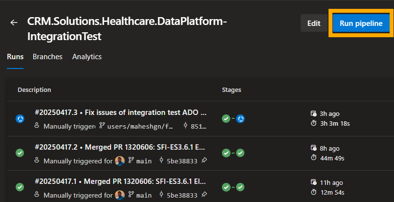
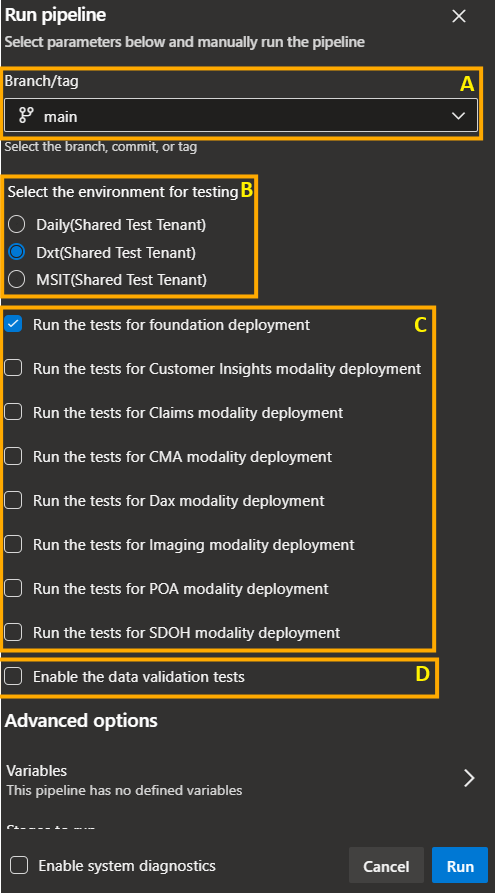

## Overview

The Integration Test Framework is a tool used to automate validating Health Data Solutions (HDS) on Fabric. These tests will perform the actions similar to what a user or customer does. The purpose of this doc is to enable users to run the tests and provide other capabilities overview.

## Getting Started

Before getting started, it is critical to think about what exactly you want to test and where. Followign section will give you high level overview on choices.

### Where the tests should execute

Decide on in which tenant and level to run the test. Tenants wise, it can be in MS internal tenant, fabric shared test tenant or accelerator tenant.
In each tenant you can run them in DXT, Daily or MSIT levels.

Details about above information will be stored in a .json file and placed in the 'config' folder. For running in MS internal tenant with your credential, this config is not needed.

### What to test

Currently, integration tests supports following type of tests:
1. Deployment tests: This validates the sanity of the artifacts in the deployment.
2. Data validation : This test runs the pipeline against the sample data and validates the data in each lakehouses. Deployment tests are included in this.
3. Data validation with built library: This is same as the data validation tests, but locally built libraries are uploaded before running the pipeline.
4. Update capability test: These tests will validate the update capability.

### Where to trigger the tests

One can trigger the tests locally in their ubuntu image or in ADO pipelines.

1. Triggering tests locally: If you want to run the tests in MS internal tenants(your microsoft credential will be used) or any other tenants this can be used. This option will be useful for debugging, customizations and explorations. But, tests will be running in the console of your vs code and hence there are high chances of noises due to network issues or manual interruptions. Jump to [Running tests locally](#running-tests-locally) section for exact steps.

2. Triggering tests using ADO pipeline: If you want to run the tests for deployment or validate changes in a branch, this is the recommended option. More user friendly and much no external noise affects these tests. But, this has limited flexibility and run the tests only in fabric shared test tenants. Jump to [Running tests in ADO pipeline](#running-tests-in-ado-pipeline) section for exact steps.


## Running tests locally

### Setup

- 1. Install required test dependencies
    > pip install -r test-requirements

- 2. If you plan on testing against local artifacts make sure to build first
    > make build

- 3. Make sure you are on the VPN which is required for copying files from blob storage.

- 4. It is recommended to setup your VSCode launch file

        location: CRM.Solutions.Healthcare.DataPlatform/.vscode/launch.json

    ```json
    {
        "version": "0.2.0",
        "configurations": [
            {
                "name":"Python Debugger: Current File",
                "type":"debugpy",
                "request":"launch",
                "program":"${file}",
                "console":"integratedTerminal",
                "purpose": ["debug-test"],
                "args": [
                    "--envConfig=shared_test_tenant_daily_testuser4.json",
                    "--pipeline_config_files=integrationTests/sdoh/sdoh_test_data_validation.json",
                ],
            }
        ]
    }
    ```
### Run and Debug

1. Update the vs code launch file as mentioned in the [Setup section](#setup)and start debugging (F5).

2. Running using the command: Run the automation_framework.py file with these parameters

| Parameter | Definition | Example Usage | Meaning during the absence |
| -- | -- | -- | -- |
| pipeline_config_files | Defines which tests to run  | --pipeline_config_files=integrationTests/foundations/foundations_e2e.json | Run all the tests listed in automation_framework.py file |
| envConfig | Configuration file for the tenant, level and user details | --envConfig=shared_test_tenant_daily_testuser4.json | Uses the credential from the logged in user in the command line. Usually it is MS internal tenant with the user's credential |
| env | Environment name where the test should run (use this when running tests in MS tenant) | --env=msit | Uses the value from envConfig or default if not provided |
| Test flags | Conditional skipping or execution of steps. For more details refer: [Test Flags](./docs/Test_Flags.md#test-flags)  | --use_existing_workspace | All the steps in the tests will be executed. |

Example:
> python automation_framework.py --pipeline_config_files=integrationTests/foundations/foundations_e2e.json --envConfig=shared_test_tenant_daily_testuser4.json --env=msit --use_existing_workspace

#### About the --env parameter

The `--env` parameter allows you to specify the target environment (such as `msit`, `dxt`, or `daily`) directly from the command line. Use this for specifying the environment when running the tests in MS tenant. If not specified, the environment is determined by the `targetEnvironment` in the config file, or environment in the test is used.


## Running tests in ADO pipeline

### Overview

Running the integration tests on a local machine has its downsides. Connection issues, machine going to sleep and a process always running in the bacground which has the risk of user intervention.
By running the tests in ADO pipeline, one can avoid above issues. With this pipeline, we can schedule the runs on daily basis to check the deployment.

### Things to note before running the pipeline

- Pipeline always runs the tests in the fabric shared test tenants. Check last section for details.
- Currently parsing the test results is not supported; hence users needs to look into logs.
- By default pipeline runs the test for deployment. But pipeline has option to run the data pipeline and validate the data.
- Users can select in which stage the test needs to run, i.e Daily, Dxt, and MSIT.

### Running the pipeline

1. Go to the pipeline: [CRM.Solutions.Healthcare.DataPlatform-IntegrationTest](https://dev.azure.com/dynamicscrm/Solutions/_build?definitionId=25684)
2. Click on 'Run pipeline' button on right top.<br>

3. Select options:
    1. B - Select the environment
    2. C - Select the modalities  **NOTE**: You do not select more than 3. There will be high chance of throttling.
    3. D - Select whether data valodation is needed<br>
<br>
4. Run the pipeline

### Environment config

Integration tests needs authentication to an tenant with a user context. While running locally, we use the user context. In ADO pipeline this is not available and hence we user certificate based authentication, which happens silently. For this authentication following details are needed.

1. tenantId: Tenant ID.
2. redirectUri: Redirect URL which is configured for power BI for the tenant.
3. targetEnvironment: Whether the environment is daily, dxt, msit or prod.
4. userDetails: user name and certificate name.

Above information are embodied in a json file and will be referred by the command line parameter 'envConfig' while running the test. Example:
```yml
python3.10 /home/maheshgn/CRM.Solutions.Healthcare.DataPlatform/src/tools/automation/AutomationFramework/automation_framework.py --envConfig=test_tenant_daily_testuser4.json
```
### Environment config for ado pipeline

ADO pipeline will run the tests in [fabric shared test tenants](https://eng.ms/docs/cloud-ai-platform/azure-data/azure-data-intelligence-platform/microsoft-fabric-platform/fabric-platform-shared-services/power-bi-troubleshooting-guides/troubleshooting/adhoc_account_user_details?tabs=Access). Following are the users for each tenants
1. Daily - Testuser4@fabricdaily02262025.onmicrosoft.com
2. DXT - Testuser3@fabricdxt02262025.onmicrosoft.com
3. MSIT - Testuser2@fabricmsit02262025.onmicrosoft.com

# FAQ

**How do I configure the environment? (daily, dxt, msit)**

1. MS internal tenant with your microsoft credentials(Not supported for ADO): Make sure you are part of the security group allowing you to access Daily/DXT without a Fabric Test account. If you're using an environment config file, you can modify it there. Otherwise, in `automation_framework.py` you can change the default environment from `msit`.
2. Other tenants: Make sure that user has the certificate based authentication and download the certificates. Create an environment config file in the configs folder along with the certificate. Refer the other config file in the same folder for the format. Pass this file name for the tests using --envConfig parameter.

**Does every tests create a new workspace? Are workspaces removed after the test completes?**

- Each test creates a new workspace
- Workspaces are not removed after the test completes

If you find yourself creating several workspaces throughout development, you can run `remove_workspaces.py`.

Example usage that previews workspaces to delete that follow a pattern (recommended to run first):
> python remove_workspaces.py -p HDS_IT_OMOP

Follow up command to actually remove workspaces. Note: This might fail if the workspace is attached to a deployment pipeline.

> python remove_workspaces.py -p HDS_IT_OMOP -d


**How long does each test take?**

It depends on the size of the sample data and the activities in the associated date pipeline, but here's what we've observed for OMOP Analytics E2E Test:

 - ~2-3 minutes for Capability deployment
 - ~12-20 minutes for the environment to publish
 - ~45 minutes for the data pipeline (4 activities) to complete
 - ~10 minutes for validation notebooks to complete

**How can I monitor the run of each test?**

There is a simple html template that is update when a test is run, you can open in a browser, location: CRM.Solutions.Healthcare.DataPlatform/pipeline_status.html

**How can I write my own test?**

It is recommended to start by taking a look at the foundations test (src/tools/automation/AutomationFramework/integrationTests/foundations/foundations_e2e.json) -- it should contain the general structure of an E2E test.