<h1 style="font-size:30px"><strong>HDS Fabric Deployment – High-Level Execution Guide</strong></h1>

# Document Purpose

This document outlines the step-by-step process to set up a Microsoft Fabric environment and execute the HDS deployment workflow. It is designed for business and technical stakeholders to follow and validate deployment of readiness in a structured manner.HDS

# 1. Create a New Workspace

Navigate to the Fabric environment: https://msit.powerbi.com/  
Log in with valid credentials.  
Go to Workspaces → New Workspace.  
Use naming format: Test_<date>_<userName>.  
  
Example: Test_04_06_2026_userName
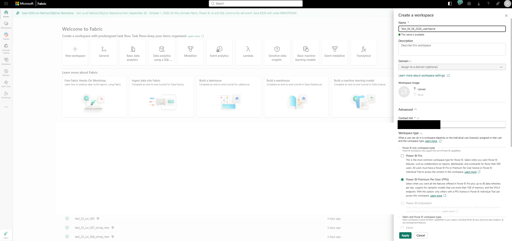

# 2. Create Lakehouse

*Note: We are creating the Lakehouse “****deployment_lakehouse****“ solely for deployment purposes; it can be deleted once the deployment is completed.*

Create a new Lakehouse named: **deployment_lakehouse**  
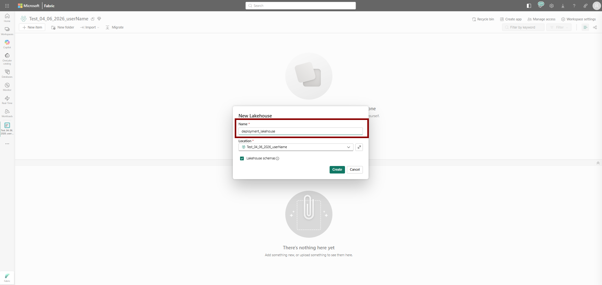

# 3. Upload Build Artifacts

Download the “**hds-build-artifacts**” folder from:  
/**hds-build-artifacts**

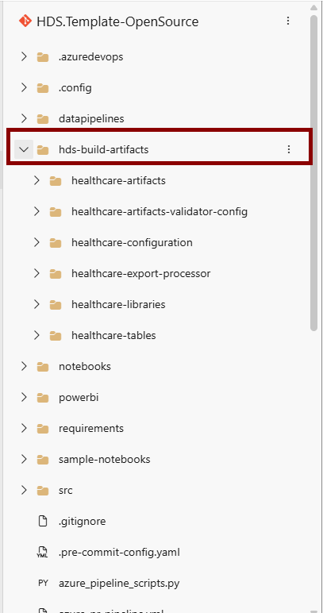

In the Downloaded folder, please verify the following files and folders are present:
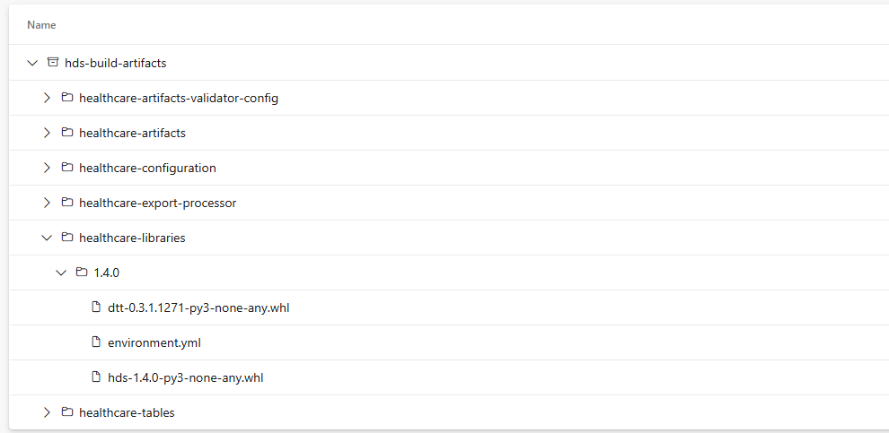

Note: if you dont find these 2 whl files under
hds-build-artifacts/healthcare-libraries/x.x.x/
1. dtt-x.x.x-py3-none-any.whl
2. hds-x.x.x-py3-none-any.whl
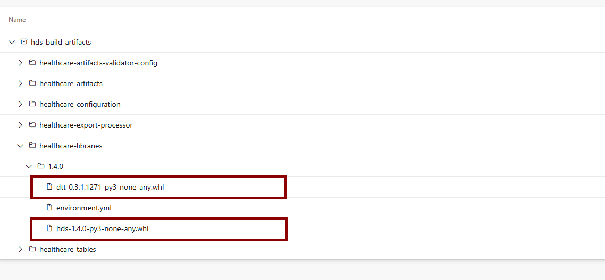
x.x.x is the version of the whl files

Please follow the below steps to generate the whl files and place them under the above mentioned location.
Navigate to /README.md in your code base and follow the steps mentioned under **Build** section to generate the whl files and place them under the above mentioned location.

Upload the “**hds-build-artifacts”** folder to Lakehouse “deployment_lakehouse” → Files. 
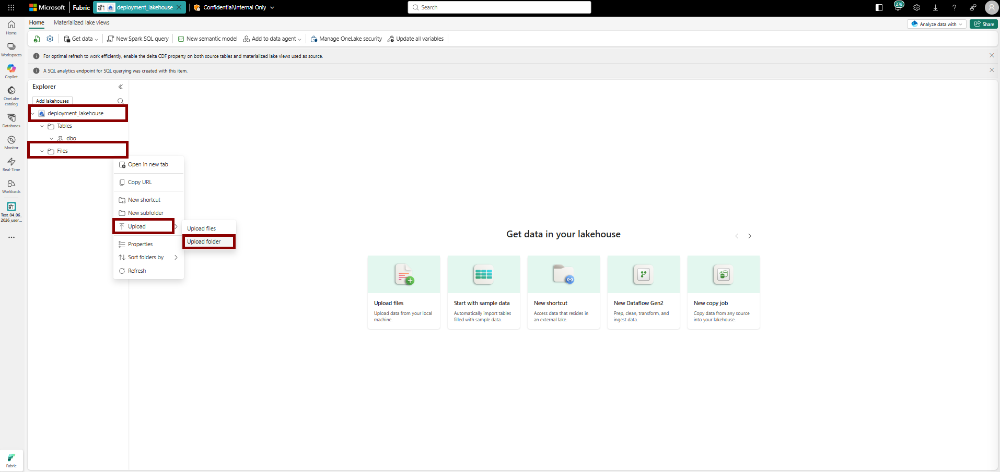

wait for all the folders and files to be uploaded. Scroll down and ensure all the files folders have been uploaded.

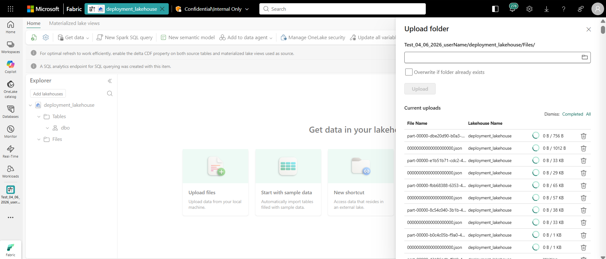

|  |
| --- |
| deployment_lakehouse -> Upload Folder -> hds-build-artifacts |

** Ensure “Upload Folder” is successfull ** 

# 4. Upload Deployment and Validation Notebooks

Download notebooks from:  
Deployment notebook path: src/tools/fabric_depolyment_notebooks

Validation notebook path: src/tools/fabric_depolyment_notebooks/validation_notebooks

* Create a new folder in the workspace named “**deployment_notebooks**”
* Download “**deployment notebooks**” and Import into Fabric Workspace
  + Download -> src/tools/fabric_depolyment_notebooks (select all and import all the notebooks to Fabric workspace)

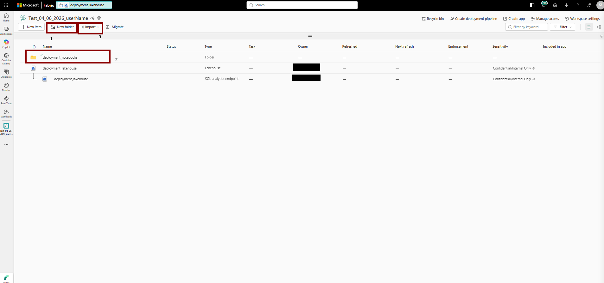

* Create a new folder in the workspace named “**validation_notebooks**”
* Download “**validation_notebooks**” and Import into Fabric Workspace
  + Download -> src/tools/fabric_depolyment_notebooks/validation_notebooks (select all and import all the notebooks to Fabric workspace)

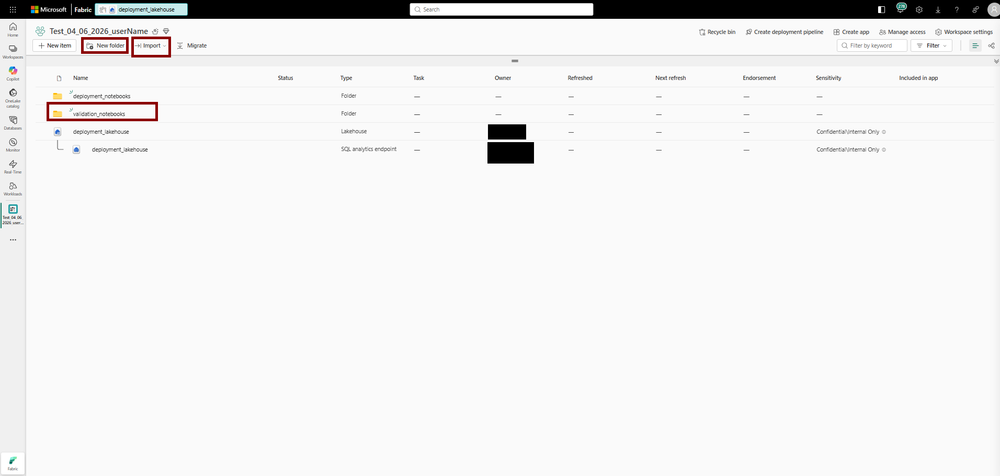

# 5. Configure Deployment Settings

Search and Open “**common_deployment_config**” notebook from the workspace and update:

Example: Update the parameters for the following variables

|  |  |  |
| --- | --- | --- |
| Config Name | default | description |
| ARTIFACT_LAKEHOUSE_NAME | ‘deployment_lakehouse’ | change if you want to use different lake house name |
| TARGET_ENVIRONMENT_NAME | ‘environment' |  |
| company_prefix | 'healthcare' | All the artifacts will be deployed with healthcare name as a prefix |
| BASE_DIST_PATH | abfss://<WORKSPACE_NAME>  @<ENDPOINT_URI>/ <LAKEHOUSE>.Lakehouse/  Files/hds-build-artifacts | No change required |

# 6. Attach Lakehouse to Notebooks

Attach “deployment_lakehouse” to:

* Search and Open – “**master_deployer”** and attach “**deployment_lakehouse**”

*Note:follow the below steps to attach the Lakehouse.*

*Click on Add data items => From oneLake Catalog => add the Lakehouse created in step3.*

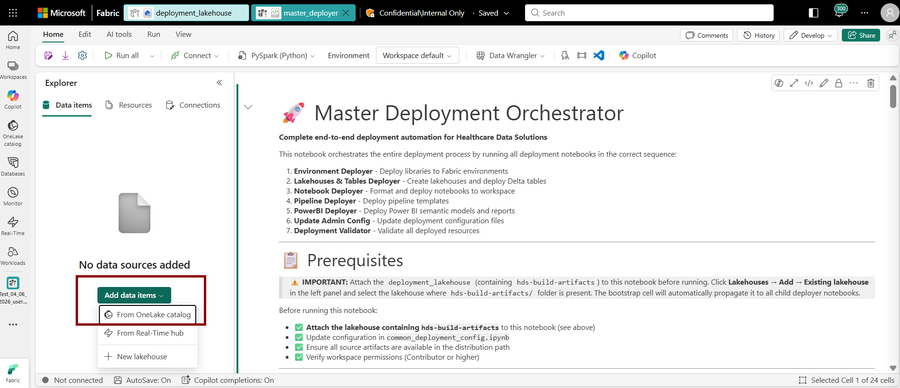

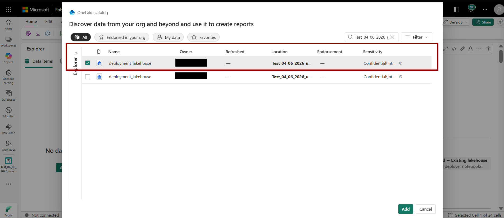

# 7. Execute Master Deployment

Connect the session and run **master_deployer** notebook, this will run the following individual notebooks:

1. build_artifacts_validator

2. environment_deployer

3. lakehouses_and_tables_deployer

4. notebook_deployer

5. pipeline_deployer

6. powerbi_deployer

7. update_admin_config

8. deployment_validator

*Note: If any step fails as part of master_deployer execution, please run the respective failed notebook. Make sure this step is executed once the* ***master_deployer notebook*** *execution completes.*

*for example, there is a slight chance as part of* ***master_deployer*** *execution,* ***lakehouses_and_tables_deployer*** *might fail in table deployment, in that case, run this* *particular notebook* ***lakehouses_and_tables_deployer*** *directly.*

**Deployment Time Breakdown**

Total deployment time (Master Deployer): ~10 minutes

* Build Artifacts Validator : ~20 seconds
* Environment Deployer: ~20 seconds *(Publishing takes* *approximately 35–45 minutes)*
* Lakehouses and Tables Deployer: ~5 minutes
* Notebook Deployer: ~2 minutes
* Pipeline Deployer: ~1 minute
* powerbi_deployer: ~ 2 minutes
* Admin Config Update: ~30 seconds
* deployment_validator: ~1 minute

# 8. Upload Sample data and copy to ingest folder

* Download and upload the “Sample data” into root folder **Files/SampleData**(refer below image) for the following capabilities
  + Clinical
  + Imaging
  + Claims
  + SDOH
* Download and upload the “Refence data” into root folder **Files/ReferenceData**(refer below image) for the following capabilities
  + Clinical
  + SDOH

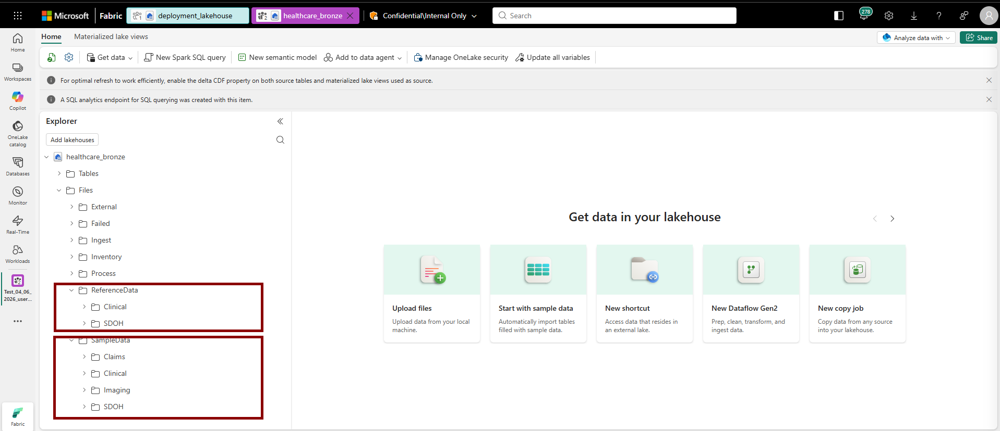

# 9. Trigger the pipelines

Run the pipelines in the following order:

1. Clinical: healthcare_msft_clinical_data_foundation_ingestion
2. Imaging: healthcare_msft_imaging_with_clinical_foundation_ingestion
3. Omop : healthcare_msft_omop_analytics
4. Claims: healthcare_msft_claims_data_ingestion
5. Sdoh : healthcare_msft_sdoh_ingestion
6. Cma : healthcare_msft_cma

***Note: Do not run the pipelines parallelly. Run each pipeline one after another.***