<h1 style="font-size:30px"><strong>Migration Guide</strong></h1>

**Purpose:**

This document provides a structured process for executing the realease version 1.4.0 HealthDataManager lakehouse migration, validating the required configuration updates, and confirming that the expected folder structure and notebook settings are in place. It is intended to support accurate and consistent migration execution across the target environment.

**Prerequisites**: Please collect the following source and target lakehouse IDs before starting the migration.

* Admin Lakehouse ID (GUID) (for example, healthcare1\_msft\_admin)

Steps to obtain the ID

* Click and navigate to the **Admin Lakehouse**, then copy the highlighted ID from the URL below.

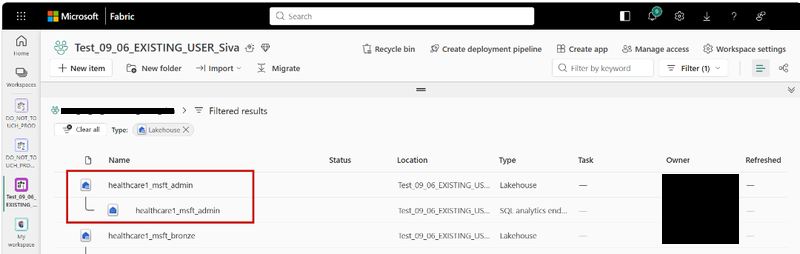

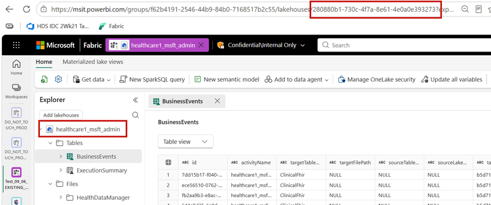

* Lakehouse: HealthDataManager ID (GUID) for the corresponding Healthcare Data Solution

Steps to obtain the HealthDataManager lakehouse ID

* Click and navigate to the Healthcare Data Solution, then copy the highlighted ID from the URL below.

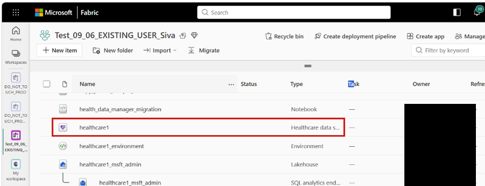

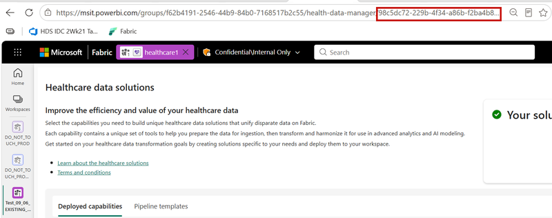

# Instructions for Running the Migration Notebook

1. Open the **health\_data\_manager\_migration** notebook.
2. Enter the **ADMIN\_LAKEHOUSE\_ID** and **HEALTHDATAMANAGER\_LAKEHOUSE\_ID** values in the configuration cell.

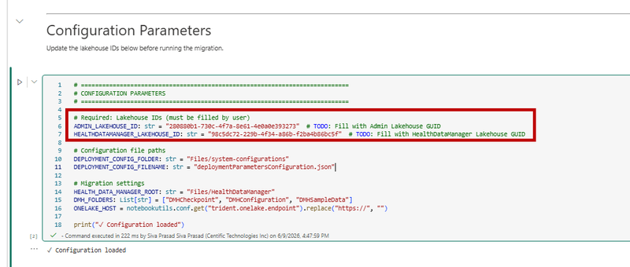

1. Connect the session, then run all cells in sequence.
2. Review the completion summary and confirm that no folders are missing.
3. Ensure that the final step is completed. It’s a manual step to be done by end user.

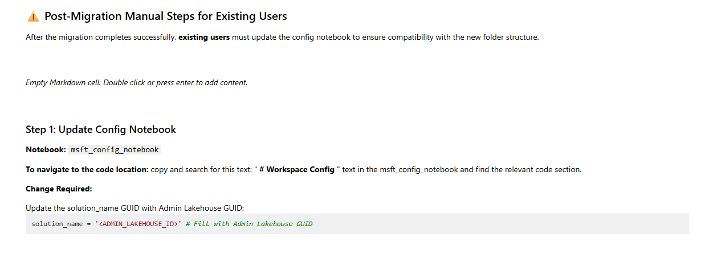

**Verification: -**

1. Open the Admin Lakehouse (for example, healthcare1\_msft\_admin).
2. From the left navigation pane, open Files, then navigate to system-configurations and confirm that the following two files are present.
   * Go to the Admin Lakehouse (for example, healthcare1\_msft\_admin).
   * From the left navigation pane, open Files, then go to system-configurations and verify that the following two files are present.

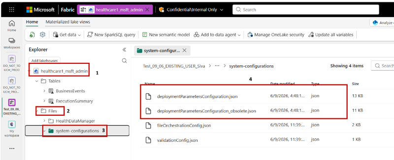

3. Within the Files section, locate the **HealthDataManager** folder and confirm that the two folders highlighted shall be present.

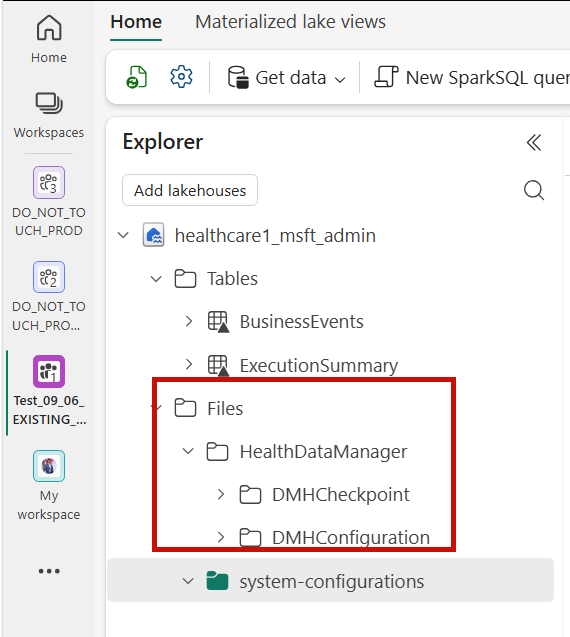

   * Expand **DMHCheckpoint** to verify that the folder structure matches the expected layout shown below.

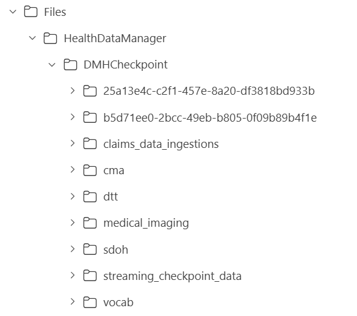

   * Expand **DMHConfiguration** to verify that the folder structure matches the expected layout shown below.

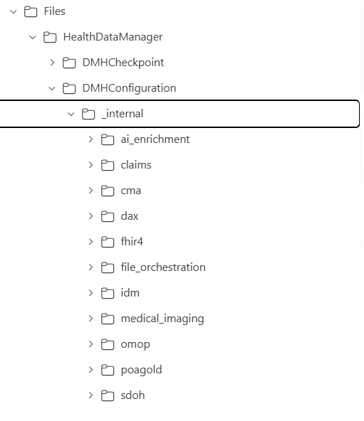

4. Locate and open the <healthcare1\_>**msft\_config\_notebook** in the current workspace.
   * Use the browser search to find "** Resolves correct path if the config files are in a Lakehouse**". This entry must be present in cell 4 or in the last but 1 cell.

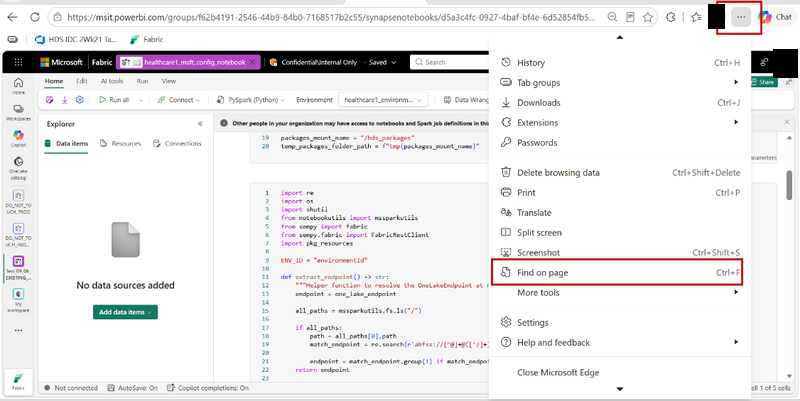

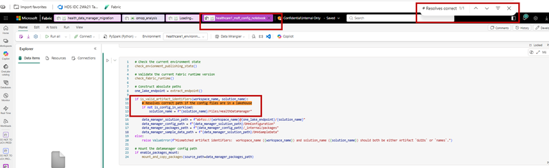

6. If any cell is locked and cannot be edited:
   * Select “Unlock cell” from the options menu to enable editing.

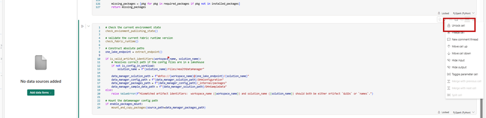

7. Verify that the solution_name GUID is updated with ADMIN_LAKEHOUSE_ID as shown in the picture. 

   **Note:** As part of the migration, we are moving all the artifacts to admin lakehouse, hence we need to change the solution name guid to admin lakehouse guid

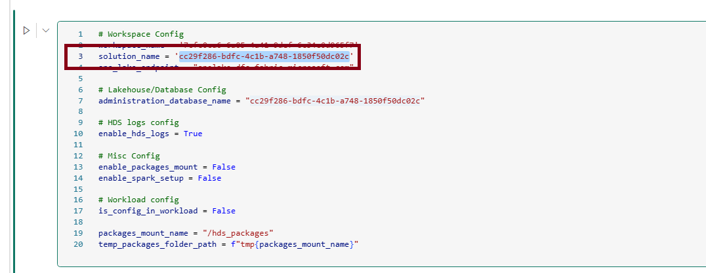

8. Verify that the is_config_in_workload flag updated to False as shown in the picture. 

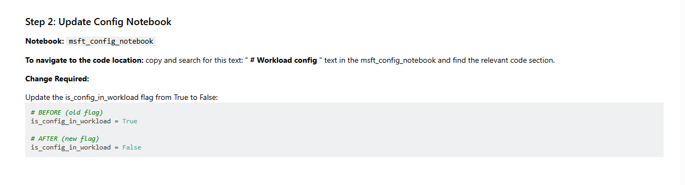

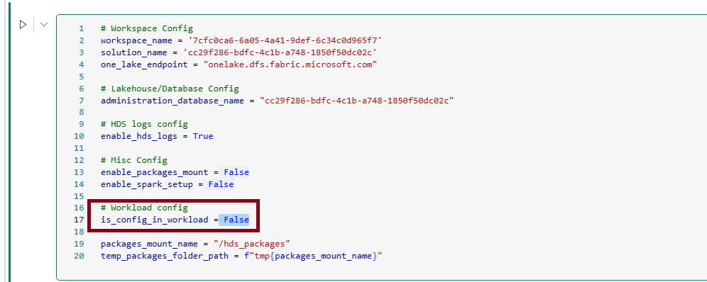

9. Verify that the solution name path exactly matches as shown in the picture. 

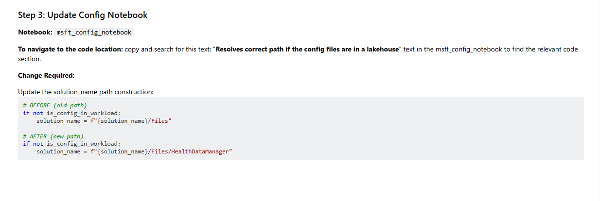

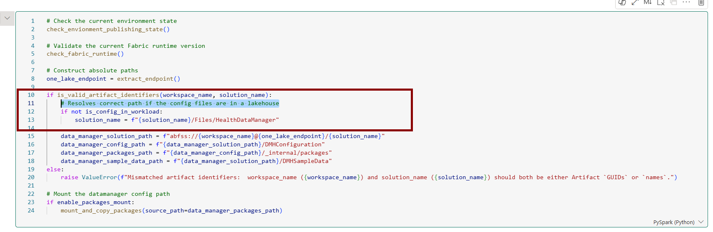